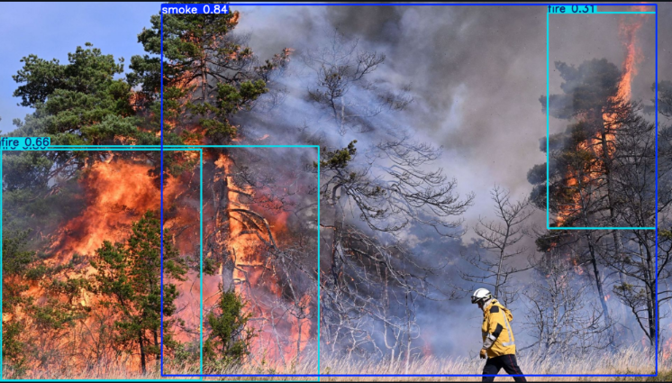
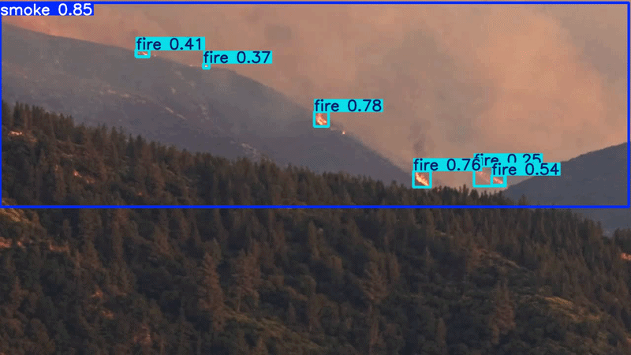

# Fire & Smoke Detection — YOLO26s × D-Fire

A complete deep learning pipeline for real-time fire and smoke detection using YOLO26s trained on the D-Fire dataset. Designed for deployment on surveillance cameras and drones.

---

## Results

| Class | Precision | Recall | mAP@50 | mAP@50-95 |
|-------|----------:|-------:|-------:|----------:|
| **All** | 0.779 | 0.734 | 0.798 | 0.461 |
| Smoke | 0.880 | 0.850 | 0.870 | 0.517 |
| Fire  | 0.920| 0.890| 0.910 | 0.405 |

Trained on **Kaggle** — 2× GPU Tesla P100 16 GB — 100 epochs — imgsz 1280

---

## Demo

### Images

<p align="center">
  
  
</p>

### Videos

<p align="center">
  
  
</p>

## Dataset — D-Fire

| Property | Detail |
|----------|--------|
| Total images | ~21,000 |
| Classes | `fire`, `smoke` |
| Format | YOLO `.txt` (normalized cx, cy, w, h) |
| Split | Train 70% / Val 20% / Test 10% |

Download via KaggleHub:
```python
import kagglehub
path = kagglehub.dataset_download("shubhamkarande13/d-fire")
```

---

## Model — YOLO26s

YOLO26s was chosen for its balance between accuracy and inference speed:

- Decoupled detection head — better convergence
- Anchor-free — improved generalization across object scales
- 1280×1280 resolution — detects small distant smoke plumes
- Native multi-GPU (DDP) support

---

## Project Structure

```
fire-smoke-detection-yolo26s/
├── D_Fire_YOLO26s.ipynb      # Full pipeline notebook
├── requirements.txt           # Python dependencies
├── .gitignore
└── README.md
```

---

## Quickstart

### 1. Install dependencies

```bash
pip install -r requirements.txt
```

### 2. Run inference on an image

```python
from ultralytics import YOLO

model = YOLO("best.pt")  # load your trained weights
results = model.predict(source="your_image.jpg", conf=0.3, imgsz=1280)
results[0].show()
```

### 3. Run inference on a video

```python
results = model.predict(source="your_video.mp4", conf=0.25, imgsz=1280, save=True)
```

---

## Training

Training was performed on Kaggle with the following configuration:

```python
model.train(
    data="fire_config.yaml",
    epochs=100,
    imgsz=1280,
    device=[0, 1],
    batch=16,
    patience=30,
    mosaic=1.0,
    mixup=0.2,
)
```

Full training code is documented in the notebook.

---

## Notebook Overview

| Section | Description |
|---------|-------------|
| 1. Environment | GPU check, dependencies |
| 2. Dataset | D-Fire download, class distribution |
| 3. EDA | Annotation stats, bbox geometry, augmentation |
| 4. Architecture | YOLO26s justification, pipeline |
| 5. Training | Multi-GPU training code |
| 6. Results | Loss curves, confusion matrix, batch visualization |
| 7. Evaluation | mAP, precision/recall per class |
| 8. Inference | Image & video prediction |
| 9. Conclusion | Summary, export, deployment perspectives |

---

## Deployment Perspectives

| Target | Path |
|--------|------|
| Edge devices | Export to ONNX → TensorRT → Jetson / Raspberry Pi |
| Drone integration | Real-time frame analysis with alert trigger |
| Surveillance | PTZ camera tracking with inter-frame detection |

---

## License

This project is released under the MIT License.  
The D-Fire dataset is subject to its own license — see the [original dataset page](https://www.kaggle.com/datasets/shubhamkarande13/d-fire).

---

## Acknowledgements

- [Ultralytics YOLO](https://github.com/ultralytics/ultralytics)
- [D-Fire Dataset](https://www.kaggle.com/datasets/shubhamkarande13/d-fire)
- Training infrastructure: Kaggle Notebooks
